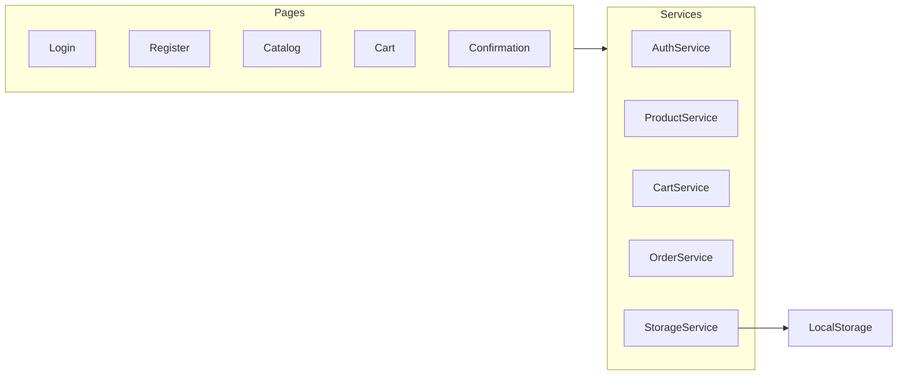
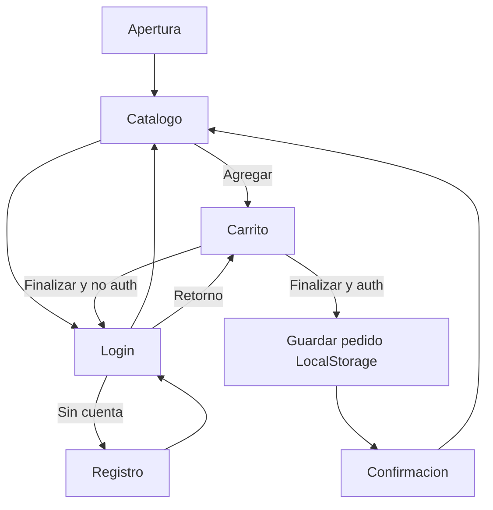

# Plan de construcción — Prueba técnica Ionic

Plan accionable para construir la aplicación e-commerce híbrida a partir de [context.md](context.md). El repositorio se crea desde cero.

## Decisiones acordadas

- **Persistencia:** Ionic + LocalStorage + JSON mock (sin backend/.NET/Firebase).
- **Análisis de puntos:** solo documento Markdown, **fuera** de la app e-commerce.
- **Stack del enunciado:** Ionic + Cordova, TypeScript y Angular, APK Android.

## Stack propuesto

- Ionic Angular (CLI `ionic start`, plantilla `blank`, integración Cordova).
- Cordova para generar APK (`ionic cordova platform add android` + `ionic cordova build android`).
- Angular: rutas, guards, servicios, reactive forms.
- Datos iniciales: JSON/constantes de 3 productos con imágenes dummy en `src/assets`.

> Cordova está deprecado frente a Capacitor, pero el enunciado lo pide de forma explícita. Si el entorno de build Android falla, se documentará en el README el comando y los prerrequisitos (JDK, Android SDK).

## App e-commerce — pantallas y reglas

| Pantalla | Ruta | Comportamiento |
|---|---|---|
| Login | `/login` | Email + password; enlace a registro |
| Registro | `/register` | Nombre, email, password; validaciones (requeridos, email, password mín. 6) |
| Catálogo | `/catalog` | 3 productos: nombre, imagen dummy, precio; “Agregar al carrito” |
| Carrito | `/cart` | Ítems, cantidades, total; “Finalizar compra” |
| Confirmación | `/confirmation` | Mensaje de éxito; pedido persistido |

**Checkout:** si no hay sesión, redirigir a `/login` (guardar URL de retorno `/cart`). Tras login, volver al carrito y permitir finalizar.

**Sesión:** usuario actual en LocalStorage (`currentUser`). Usuarios registrados en `users`. Carrito en `cart`. Pedidos en `orders`.

## Arquitectura

Estructura de carpetas prevista:

- `src/app/pages/` — login, register, catalog, cart, confirmation
- `src/app/services/` — auth, products, cart, orders, storage
- `src/app/models/` — User, Product, CartItem, Order
- `src/app/guards/auth.guard.ts` — protege finalizar compra / confirmation
- `src/assets/products.json` (o constante) + imágenes dummy

## Flujo de la aplicación

## Documentación a generar (además del código)

1. **PlanAccion.md** — este plan, accionable por fases.
2. **README.md** — cómo instalar, correr en browser (`ionic serve`), añadir plataforma Cordova, generar APK, y decisiones (LocalStorage, 3 productos, sin pagos reales).
3. **docs/flujo-aplicacion.md** — diagrama Mermaid del flujo e-commerce (navegación, auth y pedido).
4. **docs/analisis-puntos-cuota.md** — prueba de análisis: módulo de puntos **documentado**, no implementado en la app.

## Módulo de análisis (solo documento)

Estructurar un módulo conceptual (entidades, reglas, cálculo, ejemplo) para:

- **Cuota pesos:** total `$11.000.000`. El usuario ingresa lo ejecutado; se calcula `% = ejecutado / 11_000_000`. Puntos por bandas 80–100 / 50–79 / 30–49 / 10–29 / &lt;10%.
- **Cuota unidades:** total `6.000`. Puntos por rangos de unidades vendidas (tal como el enunciado).
- **Salida:** puntos por pesos, puntos por unidades, y **suma**.

En el documento se dejarán explícitas las **ambigüedades del enunciado** (solape de rangos de unidades; “un punto = $1.500” vs bandas fijas; “-999 productos = 100 puntos”) y una interpretación coherente para el cálculo, sin meter pantalla en la app.

## Fases de implementación

1. Escribir `PlanAccion.md` con este contenido.
2. Scaffold Ionic Angular + Cordova; routing y layout con componentes Ionic.
3. Modelos + `StorageService` + seed de 3 productos.
4. Auth: registro, login, logout, `AuthGuard`.
5. Catálogo + carrito (add/remove/cantidad/total).
6. Checkout: guard de sesión, persistir pedido, pantalla de confirmación.
7. UI consistente (toolbar, cards, botones, mensajes de validación).
8. README + `docs/flujo-aplicacion.md` + `docs/analisis-puntos-cuota.md`.
9. Intentar build APK; documentar prerrequisitos si el SDK no está en la máquina.

## Criterios de hecho

- Navegación completa entre las 5 pantallas.
- Validaciones de registro/login.
- Catálogo con 3 productos y add-to-cart.
- Carrito con total; checkout exige login.
- Pedido visible como “guardado” (LocalStorage).
- README, flujo Mermaid y análisis de puntos en Markdown.
- APK o, si no hay Android SDK, pasos exactos en el README.
