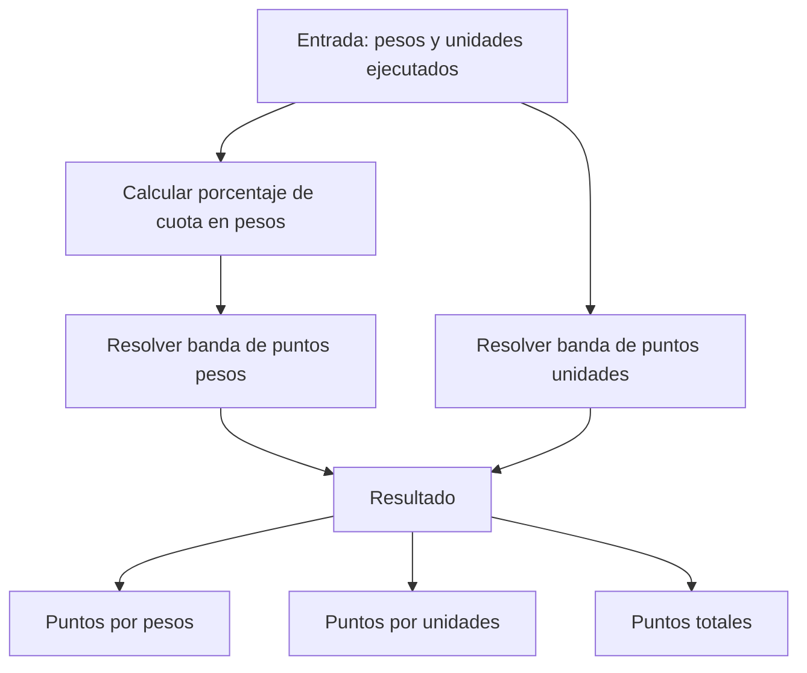

# Análisis: módulo de puntos por cuota de venta

Documento de la **prueba de análisis**. No forma parte de la app e-commerce; describe cómo estructurar un módulo que calcule puntos por cumplimiento de cuota.

## Objetivo

Dado lo que el usuario **ya ejecutó** en el trimestre (pesos y unidades), el módulo debe responder:

1. Cuántos puntos gana por **cuota en pesos**.
2. Cuántos puntos gana por **cuota en unidades**.
3. Cuántos puntos gana **en total** (suma de ambos).

## Ambigüedades del enunciado

Se dejan explícitas para no esconder reglas contradictorias:

| Punto | Qué dice el enunciado | Interpretación usada en el cálculo |
|---|---|---|
| Valor del punto | “Un punto equivale a $1.500” | **No se usa** en las bandas. Las bandas asignan un número fijo de puntos. Esa frase se trataría como otra política (puntos = pesos / 1500) si negocio la confirma. |
| Pesos > 100% | Solo define 80%–100% = 100 puntos | `>= 80%` otorga 100 puntos (incluye sobrecumplimiento). |
| Rangos de unidades | “+6.000 a 4.000” vs “3.999 a 2.000” vs “2.999 a 1.000” | Hay **solape** entre 2.000 y 2.999. Se prioriza el rango **más alto** que aplique. |
| “-999 productos = 100 puntos” | Literalmente 0–999 daría 100 puntos, más que vender 1.000–1.999 (50) | Se toma como **error de redacción**. Interpretación: **0–999 unidades = 0 puntos**. |

## Constantes de negocio

```text
CUOTA_PESOS_TRIMESTRE     = 11_000_000   COP
CUOTA_UNIDADES_TRIMESTRE  = 6_000        unidades
```

El usuario ingresa:

- `pesosEjecutados` (cuota trimestral ejecutada en pesos)
- `unidadesEjecutadas` (unidades vendidas en el trimestre)

## Estructura del módulo



### Entidades

```text
QuotaConfig
  pesosTarget: number
  unitsTarget: number
  pesoBands: { minPercent, maxPercent, points }[]
  unitBands: { minUnits, maxUnits, points }[]

QuotaInput
  executedPesos: number
  executedUnits: number

PointsBreakdown
  pesosPercent: number
  pesosPoints: number
  unitsPoints: number
  totalPoints: number
```

### Servicios sugeridos (si se implementara)

- `QuotaConfigService` — constantes y tablas de bandas.
- `PointsCalculatorService` — porcentaje, resolución de banda, suma.
- `QuotaModule` — UI de captura + visualización del desglose (fuera de alcance de esta entrega).

El calculador no depende de Ionic: es lógica de dominio pura (fácil de testear).

## Reglas — cuota en pesos

```text
porcentaje = (pesosEjecutados / 11_000_000) * 100
```

| Cumplimiento | Puntos |
|---|---|
| 80% – 100% (y más) | 100 |
| 50% – 79% | 70 |
| 30% – 49% | 40 |
| 10% – 29% | 20 |
| menor a 10% | 0 |

Límites inclusivos en el mínimo de cada banda. Evaluación de **arriba hacia abajo** (primera banda que cumpla).

## Reglas — cuota en unidades (interpretación coherente)

Cuota de referencia: 6.000 unidades. El puntaje se asigna por **unidades vendidas**, no por porcentaje.

| Unidades vendidas | Puntos |
|---|---|
| 4.000 o más (incluye superar 6.000) | 150 |
| 2.000 – 3.999 | 100 |
| 1.000 – 1.999 | 50 |
| 0 – 999 | 0 |

Así se elimina el solape 2.000–2.999 y el premio anómalo de “menos de 1.000 = 100 puntos”.

## Pseudocódigo

```text
function calcularPuntos(pesosEjecutados, unidadesEjecutadas):
  pesosPercent = (pesosEjecutados / 11_000_000) * 100

  if pesosPercent >= 80: pesosPoints = 100
  else if pesosPercent >= 50: pesosPoints = 70
  else if pesosPercent >= 30: pesosPoints = 40
  else if pesosPercent >= 10: pesosPoints = 20
  else: pesosPoints = 0

  if unidadesEjecutadas >= 4000: unitsPoints = 150
  else if unidadesEjecutadas >= 2000: unitsPoints = 100
  else if unidadesEjecutadas >= 1000: unitsPoints = 50
  else: unitsPoints = 0

  return {
    pesosPoints,
    unitsPoints,
    totalPoints: pesosPoints + unitsPoints
  }
```

## Ejemplo

Usuario con **$8.800.000** ejecutados y **4.500** unidades:

- Pesos: 8.800.000 / 11.000.000 = **80%** → **100 puntos**
- Unidades: 4.500 ≥ 4.000 → **150 puntos**
- **Total: 250 puntos**

Otro caso: **$4.400.000** (40%) y **1.200** unidades:

- Pesos: 40% → **40 puntos**
- Unidades: 1.200 → **50 puntos**
- **Total: 90 puntos**

## Cómo se conectaría con la app (futuro)

No está cableado. Un diseño limpio sería un feature module `quota-points` con una pantalla de captura y este calculador, reutilizando `AuthService` solo para asociar el resultado al usuario en LocalStorage (`quotaResults`).
