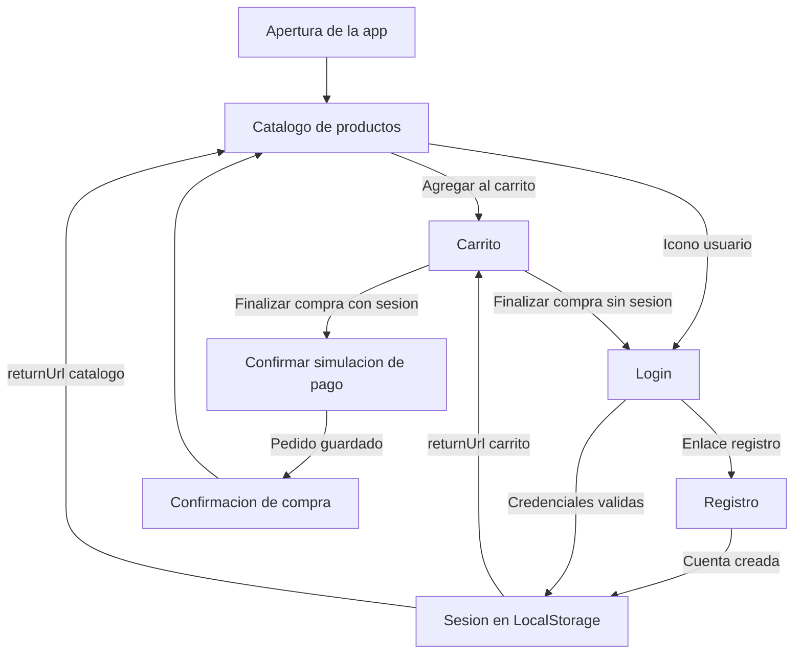
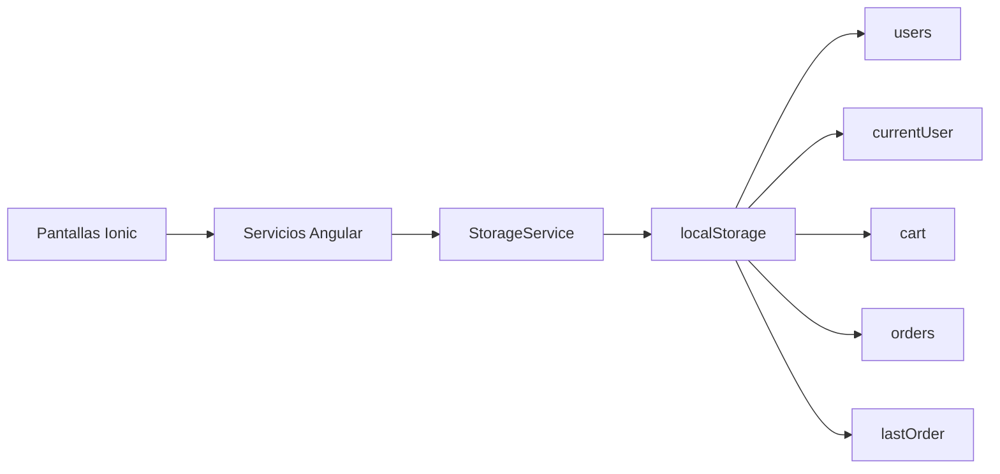
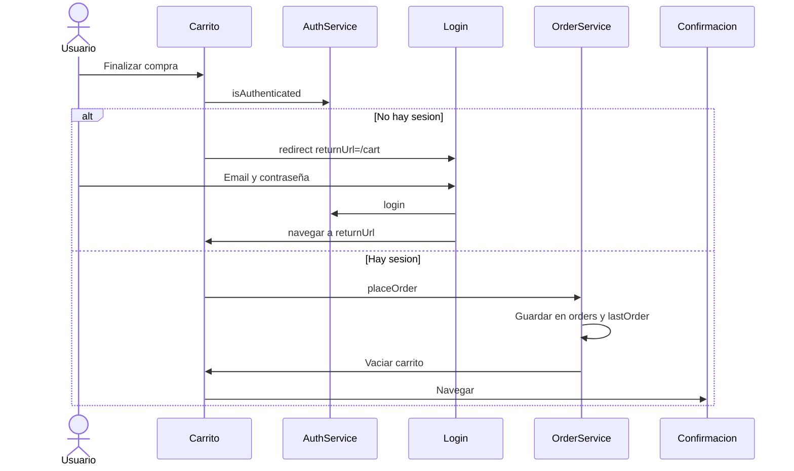

# Flujo de la aplicación

Diagrama de navegación, autenticación y simulación de compra de la tienda híbrida.

## Flujo principal

## Persistencia

## Checkout y guard

La ruta `/confirmation` también está protegida por `AuthGuard`: si no hay `currentUser`, se envía a `/login`.
